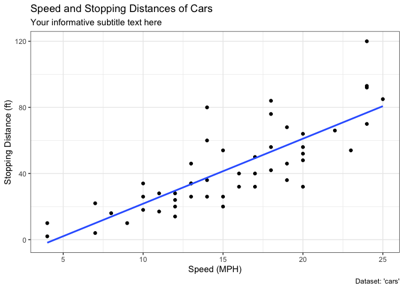
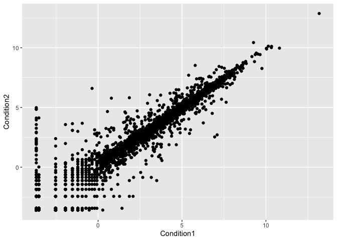

Class 05 Data Visualization
================
Katherine Wong PID (A16162648)
2021-12-02

``` r
#Let's start with a scatterplot
#Before we can use it we need to load it up!

#install.packages("ggplot2) 
library(ggplot2)

# Every ggplot has a data + aes + geoms
ggplot(data=cars) +
  aes(x=speed, y=dist) +
  geom_point() +
  geom_smooth()
```

    ## `geom_smooth()` using method = 'loess' and formula 'y ~ x'

<!-- -->

``` r
#Change to a linear model
p <- ggplot(data=cars) +
  aes(x=speed, y=dist) +
  geom_point() +
  geom_smooth(method="lm")

p + labs(title="My nice plot",
         x="Speed (MPH)", y="Distance")
```

    ## `geom_smooth()` using formula 'y ~ x'

<!-- -->

``` r
#Base graphics is shorter
plot(cars)
```

<!-- -->

``` r
#BW theme & extra labels!
ggplot(cars) + 
  aes(x=speed, y=dist) +
  geom_point() +
  labs(title="Speed and Stopping Distances of Cars",
       x="Speed (MPH)", 
       y="Stopping Distance (ft)",
       subtitle = "Your informative subtitle text here",
       caption="Dataset: 'cars'") +
  geom_smooth(method="lm", se=FALSE) +
  theme_bw()
```

    ## `geom_smooth()` using formula 'y ~ x'

<!-- -->

``` r
#Anti-viral drug
#First read the dataset
url <-  "https://bioboot.github.io/bimm143_S20/class-material/up_down_expression.txt"
genes <- read.delim(url)
head(genes)
```

    ##         Gene Condition1 Condition2      State
    ## 1      A4GNT -3.6808610 -3.4401355 unchanging
    ## 2       AAAS  4.5479580  4.3864126 unchanging
    ## 3      AASDH  3.7190695  3.4787276 unchanging
    ## 4       AATF  5.0784720  5.0151916 unchanging
    ## 5       AATK  0.4711421  0.5598642 unchanging
    ## 6 AB015752.4 -3.6808610 -3.5921390 unchanging

``` r
#Q. How many genes
nrow(genes)
```

    ## [1] 5196

``` r
#Q. How to access State col
table(genes$State)
```

    ## 
    ##       down unchanging         up 
    ##         72       4997        127

``` r
#Q. What % are up/down
round( table(genes$State)/nrow(genes) * 100, 2 )
```

    ## 
    ##       down unchanging         up 
    ##       1.39      96.17       2.44

``` r
#Time to plot
ggplot(genes) + 
  aes(x=Condition1, y=Condition2) +
  geom_point()
```

<!-- -->

``` r
p <- ggplot(genes) + 
    aes(x=Condition1, y=Condition2, col=State) +
    geom_point() 

#change colors, add labels
p + scale_colour_manual( values=c("blue","gray","red") ) + 
    labs(title="Gene Expresion Changes Upon Drug Treatment",
    x="Control (no drug) ",
       y="Drug Treatment")
```

<!-- -->

``` r
#OPTIONAL: going further
# File location online
url <- "https://raw.githubusercontent.com/jennybc/gapminder/master/inst/extdata/gapminder.tsv"
gapminder <- read.delim(url)
library(dplyr)
```

    ## 
    ## Attaching package: 'dplyr'

    ## The following objects are masked from 'package:stats':
    ## 
    ##     filter, lag

    ## The following objects are masked from 'package:base':
    ## 
    ##     intersect, setdiff, setequal, union

``` r
gapminder_2007 <- gapminder %>% filter(year==2007)

#Adding more variables to aes()
ggplot(gapminder_2007) +
  aes(x=gdpPercap, y=lifeExp, color=continent, size=pop) +
  geom_point(alpha=0.5)
```

<!-- -->

``` r
ggplot(gapminder_2007) + 
  aes(x = gdpPercap, y = lifeExp, color = pop) +
  geom_point(alpha=0.8)
```

<!-- -->

``` r
#Adjusting point size
ggplot(gapminder_2007) + 
  aes(x = gdpPercap, y = lifeExp, size = pop) +
  geom_point(alpha=0.5)
```

<!-- -->

``` r
ggplot(gapminder_2007) + 
  geom_point(aes(x = gdpPercap, y = lifeExp,
                 size = pop), alpha=0.5) + 
  scale_size_area(max_size = 10)
```

<!-- -->

``` r
gapminder_1957 <- gapminder %>% filter(year==1957)

#1957 Gapminder Scatterplot
ggplot(gapminder_1957) + 
  aes(x = gdpPercap, y = lifeExp, color=continent,
      size = pop) +
  geom_point(alpha=0.7) + 
  scale_size_area(max_size = 10) 
```

<!-- -->

``` r
#1957 and 2007 
gapminder_1957 <- gapminder %>% filter(year==1957 | year==2007)

ggplot(gapminder_1957) + 
  geom_point(aes(x = gdpPercap, y = lifeExp, color=continent,
                 size = pop), alpha=0.7) + 
  scale_size_area(max_size = 10) +
  facet_wrap(~year)
```

<!-- -->

``` r
#Bar plots
gapminder_top5 <- gapminder %>% 
  filter(year==2007) %>% 
  arrange(desc(pop)) %>% 
  top_n(5, pop)

gapminder_top5
```

    ##         country continent year lifeExp        pop gdpPercap
    ## 1         China      Asia 2007  72.961 1318683096  4959.115
    ## 2         India      Asia 2007  64.698 1110396331  2452.210
    ## 3 United States  Americas 2007  78.242  301139947 42951.653
    ## 4     Indonesia      Asia 2007  70.650  223547000  3540.652
    ## 5        Brazil  Americas 2007  72.390  190010647  9065.801

``` r
#generating a bar plot
ggplot(gapminder_top5) + 
  geom_col(aes(x = country, y = pop))
```

<!-- -->

``` r
#adding color to bar plot
ggplot(gapminder_top5) + 
  geom_col(aes(x = country, y = pop, fill = continent))
```

<!-- -->
