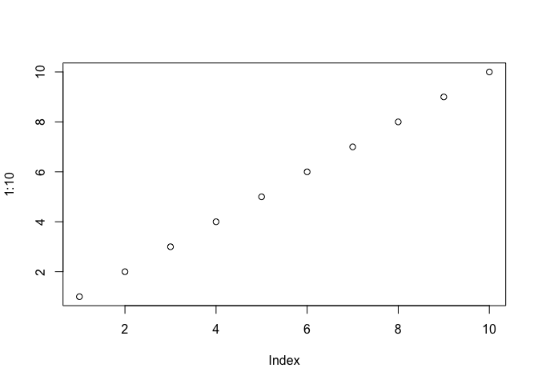

Class 6: R Functions
================
Katherine Wong (A16162648)
10/14/2021

## A play with Rmarkdown

This is some plain text. I can make things **bold**. I can also make
*things italic*.

``` r
#This is a code chunk
plot(1:10)
```

<!-- -->

## R functions

In today’s class we are going to write a function together that grades
some student work.

Questions for today:

# Q1. Write a function grade() to determine an overall grade from a vector of student homework assignment scores dropping the lowest single score. If a student misses a homework (i.e. has an NA value) this can be used as a score to be potentially dropped. Your final function should be adequately explained with code comments and be able to work on an example class gradebook such as this one in CSV format: “<https://tinyurl.com/gradeinput>” \[3pts\]

``` r
# Example input vectors to start with
student1 <- c(100, 100, 100, 100, 100, 100, 100, 90)
student2 <- c(100, NA, 90, 90, 90, 90, 97, 80)
student3 <- c(90, NA, NA, NA, NA, NA, NA, NA)
```

Let’s start with student1 and find their average score.

``` r
mean(student1)
```

    ## [1] 98.75

But we want to drop the lowest score… We could try the **min()**
function

``` r
min(student1)
```

    ## [1] 90

The **which.min()** function looks useful:

``` r
which.min(student1)
```

    ## [1] 8

This gives the position of the lowest score

``` r
# This would be the lowest score
student1[which.min(student1)]
```

    ## [1] 90

To drop this value I can use minus

``` r
student1[-which.min(student1)]
```

    ## [1] 100 100 100 100 100 100 100

Let’s now use mean() to get the average minus the lowest score.

``` r
mean(student1[-which.min(student1)])
```

    ## [1] 100

It gives NA if a student has a missing homework

``` r
mean(student2[-which.min(student1)])
```

    ## [1] NA

We need to remove the NA elements of the vector

``` r
mean(student2[-which.min(student1)], na.rm=TRUE)
```

    ## [1] 92.83333

This is not what we want. It dropped the 80 (i.e. the lowest number and
not the NA i.e. missing homework).

Let’s look at student 3

``` r
student3
```

    ## [1] 90 NA NA NA NA NA NA NA

``` r
mean(student3[-which.min(student3)], na.rm=TRUE)
```

    ## [1] NaN

one new idea/approach is we could replace the NA (missing homeworks)
with zero.

Let’s try with student2

``` r
student2
```

    ## [1] 100  NA  90  90  90  90  97  80

``` r
is.na(student2)
```

    ## [1] FALSE  TRUE FALSE FALSE FALSE FALSE FALSE FALSE

The **is.na()** function returns a logical vector where TRUE elements
represent where the NA values are

``` r
which(is.na(student2))
```

    ## [1] 2

Let’s make NA values into zeros

``` r
student.prime <- student2
student.prime
```

    ## [1] 100  NA  90  90  90  90  97  80

``` r
student.prime[which(is.na(student.prime))] = 0
student.prime
```

    ## [1] 100   0  90  90  90  90  97  80

Now we need to put this all together to get the average score dropping
the lowest where we map NA values to 0

``` r
student.prime <- student2
student.prime[ which(is.na(student.prime)) ] = 0
mean(student.prime[ -which.min(student.prime) ])
```

    ## [1] 91

``` r
student.prime
```

    ## [1] 100   0  90  90  90  90  97  80

``` r
mean(c(100, 90, 90, 90, 90, 97, 80))
```

    ## [1] 91

Looks good! Check student3

``` r
student.prime <- student3
student.prime[ which(is.na(student.prime)) ] = 0
mean(student.prime[ -which.min(student.prime) ])
```

    ## [1] 12.85714

We got our working snippet! Let’s simplify.

``` r
x <- student3
# Map NA values to 0
x[ which(is.na(x)) ] = 0
# Find the mean without the lowest value
mean(x[-which.min(x)])
```

    ## [1] 12.85714

Now we can use this as the body of my function.

``` r
grade <- function(x) {
  # Make sure our scores are all numbers
  x<- as.numeric(x)
  # Map NA values to 0
  x[ which(is.na(x)) ] = 0
  # Find the mean without the lowest value
  mean(x[-which.min(x)])
}
```

``` r
grade(student2)
```

    ## [1] 91

Now read the full gradebook CSV file.

``` r
scores <- read.csv("https://tinyurl.com/gradeinput", row.names = 1)
scores
```

    ##            hw1 hw2 hw3 hw4 hw5
    ## student-1  100  73 100  88  79
    ## student-2   85  64  78  89  78
    ## student-3   83  69  77 100  77
    ## student-4   88  NA  73 100  76
    ## student-5   88 100  75  86  79
    ## student-6   89  78 100  89  77
    ## student-7   89 100  74  87 100
    ## student-8   89 100  76  86 100
    ## student-9   86 100  77  88  77
    ## student-10  89  72  79  NA  76
    ## student-11  82  66  78  84 100
    ## student-12 100  70  75  92 100
    ## student-13  89 100  76 100  80
    ## student-14  85 100  77  89  76
    ## student-15  85  65  76  89  NA
    ## student-16  92 100  74  89  77
    ## student-17  88  63 100  86  78
    ## student-18  91  NA 100  87 100
    ## student-19  91  68  75  86  79
    ## student-20  91  68  76  88  76

Use for one student

``` r
grade(scores[10,])
```

    ## [1] 79

Now grade all students by using the **apply()** function

``` r
apply(scores, 1, grade)
```

    ##  student-1  student-2  student-3  student-4  student-5  student-6  student-7 
    ##      91.75      82.50      84.25      84.25      88.25      89.00      94.00 
    ##  student-8  student-9 student-10 student-11 student-12 student-13 student-14 
    ##      93.75      87.75      79.00      86.00      91.75      92.25      87.75 
    ## student-15 student-16 student-17 student-18 student-19 student-20 
    ##      78.75      89.50      88.00      94.50      82.75      82.75

# Q2. Using your grade() function and the supplied gradebook, Who is the top scoring student

overall in the gradebook? \[3pts\]

``` r
which.max(apply(scores, 1, grade))
```

    ## student-18 
    ##         18

``` r
max(apply(scores, 1, grade))
```

    ## [1] 94.5

The top scoring student overall is student-18, with a grade of 94.50

# Q3. From your analysis of the gradebook, which homework was toughest on students (i.e. obtained the lowest scores overall? \[2pts\]

``` r
apply(scores, 2, mean, na.rm=TRUE)
```

    ##      hw1      hw2      hw3      hw4      hw5 
    ## 89.00000 80.88889 80.80000 89.63158 83.42105

hw2 was the toughest on students, with an average of 80.89.

# Q4. Optional Extension: From your analysis of the gradebook, which homework was most

predictive of overall score (i.e. highest correlation with average grade
score)? \[1pt\]

``` r
mean(apply(scores, 1, grade))
```

    ## [1] 87.425

hw1 was the most predictive of overall score because its the closest
number to the average grade score.

# Add an ex

We want to optionally turn the dropping of lowest score off for grading

``` r
grade <- function(x, drop.lowest = TRUE) {
  # Make sure our scores are all numbers
  x<- as.numeric(x)
  # Map NA values to 0
  x[which(is.na(x))] = 0
  if (drop.lowest) {
    # Find the mean without the lowest value
    mean(x[-which.min(x)])
  } else {
    mean(x)
  }
}
```

``` r
student1 <- c(100, 100, 100, 90)
grade(student1, drop.lowest = FALSE)
```

    ## [1] 97.5
