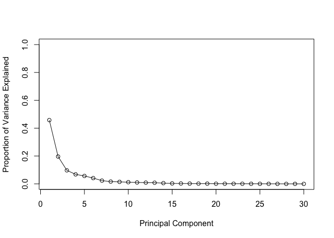
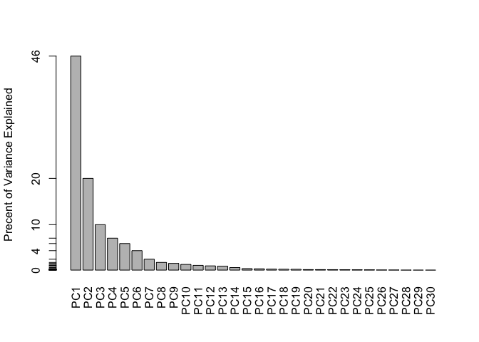
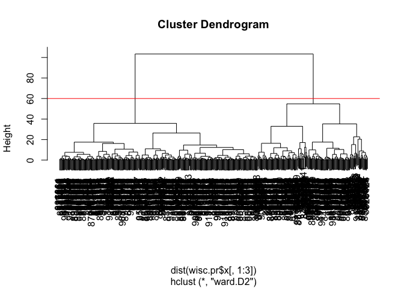

Unsupervised Mini Project
================
Katherine Wong (A16162648)
10/26/2021

# Preparing the data

# Save your input data file into your Project directory

``` r
fna.data <- "WisconsinCancer.csv"
#Complete the following code to input the data and store as wisc.df
wisc.df <- read.csv(fna.data, row.names=1)
#wisc.df
```

# Create a new data.frame that omits first column (pathologist diagnosis)

``` r
# We can use -1 here to remove the first column
wisc.data <- wisc.df[,-1]
# Create diagnosis vector for later 
diagnosis <- as.factor(wisc.df$diagnosis)
```

\#Exploratory dataset

> Q1. How many observations are in this dataset?

``` r
dim(wisc.data)
```

    ## [1] 569  30

``` r
length(diagnosis)
```

    ## [1] 569

There are 569 samples or observations in wisc.data and diagnosis.

> Q2. How many of the observations have a malignant diagnosis?

``` r
table(diagnosis)
```

    ## diagnosis
    ##   B   M 
    ## 357 212

212 of 560 observations have a malignant diagnosis.

> Q3. How many variables/features in the data are suffixed with \_mean?

``` r
length(grep("_mean", colnames(wisc.data)))
```

    ## [1] 10

There are 10 variables/features in the data that are suffixed with
\_mean

# Principal Component Analysis

Performing PCA

``` r
# Check column means and standard deviations
colMeans(wisc.data)
```

    ##             radius_mean            texture_mean          perimeter_mean 
    ##            1.412729e+01            1.928965e+01            9.196903e+01 
    ##               area_mean         smoothness_mean        compactness_mean 
    ##            6.548891e+02            9.636028e-02            1.043410e-01 
    ##          concavity_mean     concave.points_mean           symmetry_mean 
    ##            8.879932e-02            4.891915e-02            1.811619e-01 
    ##  fractal_dimension_mean               radius_se              texture_se 
    ##            6.279761e-02            4.051721e-01            1.216853e+00 
    ##            perimeter_se                 area_se           smoothness_se 
    ##            2.866059e+00            4.033708e+01            7.040979e-03 
    ##          compactness_se            concavity_se       concave.points_se 
    ##            2.547814e-02            3.189372e-02            1.179614e-02 
    ##             symmetry_se    fractal_dimension_se            radius_worst 
    ##            2.054230e-02            3.794904e-03            1.626919e+01 
    ##           texture_worst         perimeter_worst              area_worst 
    ##            2.567722e+01            1.072612e+02            8.805831e+02 
    ##        smoothness_worst       compactness_worst         concavity_worst 
    ##            1.323686e-01            2.542650e-01            2.721885e-01 
    ##    concave.points_worst          symmetry_worst fractal_dimension_worst 
    ##            1.146062e-01            2.900756e-01            8.394582e-02

``` r
apply(wisc.data,2,sd)
```

    ##             radius_mean            texture_mean          perimeter_mean 
    ##            3.524049e+00            4.301036e+00            2.429898e+01 
    ##               area_mean         smoothness_mean        compactness_mean 
    ##            3.519141e+02            1.406413e-02            5.281276e-02 
    ##          concavity_mean     concave.points_mean           symmetry_mean 
    ##            7.971981e-02            3.880284e-02            2.741428e-02 
    ##  fractal_dimension_mean               radius_se              texture_se 
    ##            7.060363e-03            2.773127e-01            5.516484e-01 
    ##            perimeter_se                 area_se           smoothness_se 
    ##            2.021855e+00            4.549101e+01            3.002518e-03 
    ##          compactness_se            concavity_se       concave.points_se 
    ##            1.790818e-02            3.018606e-02            6.170285e-03 
    ##             symmetry_se    fractal_dimension_se            radius_worst 
    ##            8.266372e-03            2.646071e-03            4.833242e+00 
    ##           texture_worst         perimeter_worst              area_worst 
    ##            6.146258e+00            3.360254e+01            5.693570e+02 
    ##        smoothness_worst       compactness_worst         concavity_worst 
    ##            2.283243e-02            1.573365e-01            2.086243e-01 
    ##    concave.points_worst          symmetry_worst fractal_dimension_worst 
    ##            6.573234e-02            6.186747e-02            1.806127e-02

# Perform PCA on wisc.data by completing the following code

``` r
wisc.pr <- prcomp(wisc.data, scale=TRUE)
# Look at summary of results
summary(wisc.pr)
```

    ## Importance of components:
    ##                           PC1    PC2     PC3     PC4     PC5     PC6     PC7
    ## Standard deviation     3.6444 2.3857 1.67867 1.40735 1.28403 1.09880 0.82172
    ## Proportion of Variance 0.4427 0.1897 0.09393 0.06602 0.05496 0.04025 0.02251
    ## Cumulative Proportion  0.4427 0.6324 0.72636 0.79239 0.84734 0.88759 0.91010
    ##                            PC8    PC9    PC10   PC11    PC12    PC13    PC14
    ## Standard deviation     0.69037 0.6457 0.59219 0.5421 0.51104 0.49128 0.39624
    ## Proportion of Variance 0.01589 0.0139 0.01169 0.0098 0.00871 0.00805 0.00523
    ## Cumulative Proportion  0.92598 0.9399 0.95157 0.9614 0.97007 0.97812 0.98335
    ##                           PC15    PC16    PC17    PC18    PC19    PC20   PC21
    ## Standard deviation     0.30681 0.28260 0.24372 0.22939 0.22244 0.17652 0.1731
    ## Proportion of Variance 0.00314 0.00266 0.00198 0.00175 0.00165 0.00104 0.0010
    ## Cumulative Proportion  0.98649 0.98915 0.99113 0.99288 0.99453 0.99557 0.9966
    ##                           PC22    PC23   PC24    PC25    PC26    PC27    PC28
    ## Standard deviation     0.16565 0.15602 0.1344 0.12442 0.09043 0.08307 0.03987
    ## Proportion of Variance 0.00091 0.00081 0.0006 0.00052 0.00027 0.00023 0.00005
    ## Cumulative Proportion  0.99749 0.99830 0.9989 0.99942 0.99969 0.99992 0.99997
    ##                           PC29    PC30
    ## Standard deviation     0.02736 0.01153
    ## Proportion of Variance 0.00002 0.00000
    ## Cumulative Proportion  1.00000 1.00000

> Q4. From your results, what proportion of the original variance is
> captured by the first principal components (PC1)?

The proportion of the original variance captured by PC1 is 0.4427 or
44.27%.

> Q5. How many principal components (PCs) are required to describe at
> least 70% of the original variance in the data?

3.  PC1: 44.27%, PC2: 18.97%, PC3: 9.39%. Together this accounts for
    more than 72.64% of the original variance in the data.

> Q6. How many principal components (PCs) are required to describe at
> least 90% of the original variance in the data?

7.  7 PCs cumulatively describe 91.01% of the original variance in the
    data.

# Interpreting PCA results

``` r
biplot(wisc.pr)
```

<!-- -->
&gt; Q7. What stands out to you about this plot? Is it easy or difficult
to understand? Why?

This plot is extremely messy and cluttered. It is difficult to
understand because so many labels are overlapping each other. Hard to
make out trends.

# Generate a more standard scatter plot of each observation along principal components 1 and 2

``` r
# Scatter plot observations by components 1 and 2
plot( wisc.pr$x[ ,1:2], col = diagnosis, 
     xlab = "PC1", ylab = "PC2")
```

<!-- -->

``` r
plot(wisc.pr$x[, c(1,3)], col = diagnosis, 
     xlab = "PC1", ylab = "PC3")
```

<!-- -->

> Q8. Generate a similar plot for principal components 1 and 3. What do
> you notice about these plots?

I notice that PC2 scores are higher than PC3. Both plots are still high
in terms of PC1. the dots higher on the PC1 scale are black (benign)
while the ones lower on the PC1 scale are red (malignant).

# Create a data.frame for ggplot

``` r
df <- as.data.frame(wisc.pr$x)
df$diagnosis <- diagnosis
```

# Load the ggplot2 package

``` r
library(ggplot2)
```

# Make a scatter plot colored by diagnosis

``` r
ggplot(df) + 
  aes(PC1, PC2, col=diagnosis) + 
  geom_point()
```

<!-- -->

# Variance explained

``` r
# Calculate variance of each component
pr.var <- wisc.pr$sdev^2
head(pr.var)
```

    ## [1] 13.281608  5.691355  2.817949  1.980640  1.648731  1.207357

``` r
# Variance explained by each principal component: pve
pve <- pr.var/29 #29 total pc

# Plot variance explained for each principal component
plot(pve, xlab = "Principal Component", 
     ylab = "Proportion of Variance Explained", 
     ylim = c(0, 1), type = "o")
```

<!-- -->

``` r
# Alternative scree plot of the same data, note data driven y-axis
barplot(pve, ylab = "Precent of Variance Explained",
     names.arg=paste0("PC",1:length(pve)), las=2, axes = FALSE)
axis(2, at=pve, labels=round(pve,2)*100 )
```

<!-- -->

``` r
## ggplot based graph
library(factoextra)
```

    ## Welcome! Want to learn more? See two factoextra-related books at https://goo.gl/ve3WBa

``` r
fviz_eig(wisc.pr, addlabels = TRUE)
```

<!-- -->

# Communicating PCA results

> Q9. For the first principal component, what is the component of the
> loading vector (i.e. wisc.pr$rotation\[,1\]) for the feature
> concave.points\_mean?

``` r
wisc.pr$rotation["concave.points_mean",1]
```

    ## [1] -0.2608538

For the first principal component, the component of the loading vector
for concave.points\_mean is -0.2608538.

> Q10. What is the minimum number of principal components required to
> explain 80% of the variance of the data?

``` r
var <- summary(wisc.pr)
var$importance[3, ]
```

    ##     PC1     PC2     PC3     PC4     PC5     PC6     PC7     PC8     PC9    PC10 
    ## 0.44272 0.63243 0.72636 0.79239 0.84734 0.88759 0.91010 0.92598 0.93988 0.95157 
    ##    PC11    PC12    PC13    PC14    PC15    PC16    PC17    PC18    PC19    PC20 
    ## 0.96137 0.97007 0.97812 0.98335 0.98649 0.98915 0.99113 0.99288 0.99453 0.99557 
    ##    PC21    PC22    PC23    PC24    PC25    PC26    PC27    PC28    PC29    PC30 
    ## 0.99657 0.99749 0.99830 0.99890 0.99942 0.99969 0.99992 0.99997 1.00000 1.00000

Minimum 5 PCs, cumulatively they account for 84.73% of the variance of
the data. 4 PCs is too little because it only accounts for 79.24% of the
variance of the data.

# Hierarchical clustering

``` r
# Scale the wisc.data data using the "scale()" function
data.scaled <- scale(wisc.data)
```

``` r
#calculate Euclidean distances between all pairs of observations in new scaled dataset and assign the result to data.dist
data.dist <- dist(data.scaled)

#create a hierarchical clustering model using complete linkage. Manually specify the method argument to hclust() and assign the results to wisc.hclust.

wisc.hclust <- hclust(data.dist)
plot(wisc.hclust)
abline(h = 19, col="red", lty=2)
```

<!-- -->
&gt; Q11. Using the plot() and abline() functions, what is the height at
which the clustering model has 4 clusters?

At height 19.

Cut the tree into 4 groups

``` r
wisc.hclust.clusters <- cutree(wisc.hclust, k=4)
```

Compare to diagnosis results

``` r
table(wisc.hclust.clusters, diagnosis)
```

    ##                     diagnosis
    ## wisc.hclust.clusters   B   M
    ##                    1  12 165
    ##                    2   2   5
    ##                    3 343  40
    ##                    4   0   2

> Q12. Can you find a better cluster vs diagnoses match by cutting into
> a different number of clusters between 2 and 10? 2 is a better cluster
> vs diagnoses match because it is closer to the actual diagnosis
> numbers! (356 B and 212 M)

``` r
wisc.hclust.clusters <- cutree(wisc.hclust, k=2)
table(wisc.hclust.clusters, diagnosis)
```

    ##                     diagnosis
    ## wisc.hclust.clusters   B   M
    ##                    1 357 210
    ##                    2   0   2

> Q13. Which method gives your favorite results for the same data.dist
> dataset? Explain your reasoning. Ward.D2 because I like spherical and
> compact clusters. And identifying a top group is helpful for me to
> understand!

# Optional: K-means clustering

``` r
wisc.km <- kmeans(data.scaled, centers= 2, nstart= 20)
table(wisc.km$cluster, diagnosis)
```

    ##    diagnosis
    ##       B   M
    ##   1  14 175
    ##   2 343  37

> Q14. How well does k-means separate the two diagnoses? How does it
> compare to your hclust results?

k-means does not separate the two diagnoses too well. Compared to
hclust, hclust is more accurate because its B and M numbers are closer
to the original diagnoses numbers (356 B and 212 M). k-means numbers are
a bit too low.

``` r
table(wisc.hclust.clusters, wisc.km$cluster)
```

    ##                     
    ## wisc.hclust.clusters   1   2
    ##                    1 187 380
    ##                    2   2   0

# Combining methods

We take the results of our PCA analysis and cluster in this space
‘wisc.pr$x’

``` r
summary(wisc.pr)
```

    ## Importance of components:
    ##                           PC1    PC2     PC3     PC4     PC5     PC6     PC7
    ## Standard deviation     3.6444 2.3857 1.67867 1.40735 1.28403 1.09880 0.82172
    ## Proportion of Variance 0.4427 0.1897 0.09393 0.06602 0.05496 0.04025 0.02251
    ## Cumulative Proportion  0.4427 0.6324 0.72636 0.79239 0.84734 0.88759 0.91010
    ##                            PC8    PC9    PC10   PC11    PC12    PC13    PC14
    ## Standard deviation     0.69037 0.6457 0.59219 0.5421 0.51104 0.49128 0.39624
    ## Proportion of Variance 0.01589 0.0139 0.01169 0.0098 0.00871 0.00805 0.00523
    ## Cumulative Proportion  0.92598 0.9399 0.95157 0.9614 0.97007 0.97812 0.98335
    ##                           PC15    PC16    PC17    PC18    PC19    PC20   PC21
    ## Standard deviation     0.30681 0.28260 0.24372 0.22939 0.22244 0.17652 0.1731
    ## Proportion of Variance 0.00314 0.00266 0.00198 0.00175 0.00165 0.00104 0.0010
    ## Cumulative Proportion  0.98649 0.98915 0.99113 0.99288 0.99453 0.99557 0.9966
    ##                           PC22    PC23   PC24    PC25    PC26    PC27    PC28
    ## Standard deviation     0.16565 0.15602 0.1344 0.12442 0.09043 0.08307 0.03987
    ## Proportion of Variance 0.00091 0.00081 0.0006 0.00052 0.00027 0.00023 0.00005
    ## Cumulative Proportion  0.99749 0.99830 0.9989 0.99942 0.99969 0.99992 0.99997
    ##                           PC29    PC30
    ## Standard deviation     0.02736 0.01153
    ## Proportion of Variance 0.00002 0.00000
    ## Cumulative Proportion  1.00000 1.00000

``` r
wisc.pr.hclust <- hclust(dist(wisc.pr$x[,1:3]), 
                         method="ward.D2")
```

Plot my dendrogram

``` r
plot(wisc.pr.hclust)
abline(h=60, col="red")
```

<!-- -->

Cut the tree into k=2 groups

``` r
grps <- cutree(wisc.pr.hclust, k=2)
table(grps)
```

    ## grps
    ##   1   2 
    ## 203 366

``` r
table(grps, diagnosis)
```

    ##     diagnosis
    ## grps   B   M
    ##    1  24 179
    ##    2 333  33

> Q15. How well does the newly created model with four clusters separate
> out the two diagnoses?

The newly created model with four clusters does not separate out the two
diagnoses too well. The numbers are not close to the actual diagnoses
numbers (356 B and 212 M)

# 6. Sensitivity/Specificity

**Accuracy** What proportion did we get correct if we call cluster 1 M
and cluster 2 B

``` r
(333 + 179)/nrow(wisc.data)
```

    ## [1] 0.8998243

**Sensitivity** refers to a test’s ability to correctly detect ill
patients who do have the condition. In our example here the sensitivity
is the total number of samples in the cluster identified as
predominantly malignant (cancerous) divided by the total number of known
malignant samples. In other words: TP/(TP+FN).

``` r
179/(179 + 33)
```

    ## [1] 0.8443396

**Specificity** relates to a test’s ability to correctly reject healthy
patients without a condition. In our example specificity is the
proportion of benign (not cancerous) samples in the cluster identified
as predominantly benign that are known to be benign. In other words:
TN/(TN+FN).

``` r
333/(333+24)
```

    ## [1] 0.9327731

> Q16. How well do the k-means and hierarchical clustering models you
> created in previous sections (i.e. before PCA) do in terms of
> separating the diagnoses? Again, use the table() function to compare
> the output of each model (wisc.km$cluster and wisc.hclust.clusters)
> with the vector containing the actual diagnoses.

``` r
table(wisc.hclust.clusters, diagnosis)
```

    ##                     diagnosis
    ## wisc.hclust.clusters   B   M
    ##                    1 357 210
    ##                    2   0   2

``` r
table(wisc.km$cluster, diagnosis)
```

    ##    diagnosis
    ##       B   M
    ##   1  14 175
    ##   2 343  37

Hierarchical clustering model did so much better. It is closer to the
actual diagnoses numbers (356 B and 212 M).

> Q17. Which of your analysis procedures resulted in a clustering model
> with the best specificity? How about sensitivity?

Hierarchical clustering: Specificity = 0.9328

``` r
333/(333+24)
```

    ## [1] 0.9327731

Sensitivity = 0.8443

``` r
179/(179 + 33)
```

    ## [1] 0.8443396

K-means =

``` r
table(wisc.km$cluster, diagnosis)
```

    ##    diagnosis
    ##       B   M
    ##   1  14 175
    ##   2 343  37

Specificity = 0.8255

``` r
175/(175+37)
```

    ## [1] 0.8254717

Sensitivity = 0.9608

``` r
343/(343 + 14)
```

    ## [1] 0.9607843

Hierarchical clustering did best in specificity. K-means did better in
sensitivity.

# Prediction

Here we read some new data and use our PCA model to examine whether they
most closely resemble M or B patients from our original dataset

``` r
url <- "https://tinyurl.com/new-samples-CSV"
new <- read.csv(url)
npc <- predict(wisc.pr, newdata=new)
npc
```

    ##            PC1       PC2        PC3        PC4       PC5        PC6        PC7
    ## [1,]  2.576616 -3.135913  1.3990492 -0.7631950  2.781648 -0.8150185 -0.3959098
    ## [2,] -4.754928 -3.009033 -0.1660946 -0.6052952 -1.140698 -1.2189945  0.8193031
    ##             PC8       PC9       PC10      PC11      PC12      PC13     PC14
    ## [1,] -0.2307350 0.1029569 -0.9272861 0.3411457  0.375921 0.1610764 1.187882
    ## [2,] -0.3307423 0.5281896 -0.4855301 0.7173233 -1.185917 0.5893856 0.303029
    ##           PC15       PC16        PC17        PC18        PC19       PC20
    ## [1,] 0.3216974 -0.1743616 -0.07875393 -0.11207028 -0.08802955 -0.2495216
    ## [2,] 0.1299153  0.1448061 -0.40509706  0.06565549  0.25591230 -0.4289500
    ##            PC21       PC22       PC23       PC24        PC25         PC26
    ## [1,]  0.1228233 0.09358453 0.08347651  0.1223396  0.02124121  0.078884581
    ## [2,] -0.1224776 0.01732146 0.06316631 -0.2338618 -0.20755948 -0.009833238
    ##              PC27        PC28         PC29         PC30
    ## [1,]  0.220199544 -0.02946023 -0.015620933  0.005269029
    ## [2,] -0.001134152  0.09638361  0.002795349 -0.019015820

Plot onto our pca model

``` r
plot(wisc.pr$x[,1:2], col=diagnosis)
points(npc[,1], npc[,2], col="blue", pch=16, cex=3)
text(npc[,1], npc[,2], c(1,2), col="white")
```

<!-- -->
&gt; Q18. Which of these new patients should we prioritize for follow up
based on your results?

benign = black malignant = red

Most likely patient 2 because it’s surrounded by multiple benign
patients, and it’s important to follow up with those who are diagnosed
with malignant tumors.
