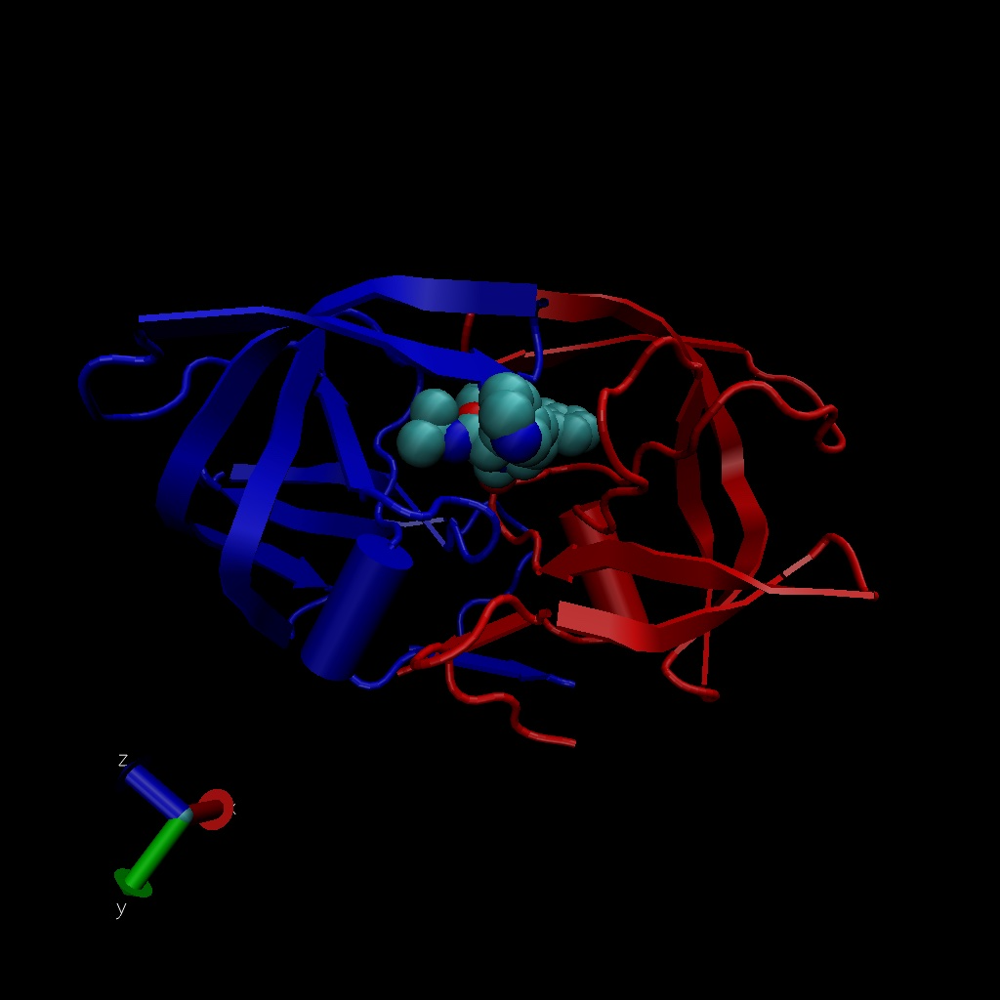

Class 11: Structural Bioinformatics Part I
================
Katherine Wong (A16162648)
11/2/2021

``` r
db <- read.csv("Data Export Summary.csv", row.names = 1)
head(db)
```

    ##                          X.ray   NMR   EM Multiple.methods Neutron Other  Total
    ## Protein (only)          142303 11804 5999              177      70    32 160385
    ## Protein/Oligosaccharide   8414    31  979                5       0     0   9429
    ## Protein/NA                7491   274 1986                3       0     0   9754
    ## Nucleic acid (only)       2368  1372   60                8       2     1   3811
    ## Other                      149    31    3                0       0     0    183
    ## Oligosaccharide (only)      11     6    0                1       0     4     22

> Q1: What percentage of structures in the PDB are solved by X-Ray and
> Electron Microscopy.

``` r
method.sums <- colSums(db)
round((method.sums/method.sums["Total"] * 100), 2)
```

    ##            X.ray              NMR               EM Multiple.methods 
    ##            87.55             7.36             4.92             0.11 
    ##          Neutron            Other            Total 
    ##             0.04             0.02           100.00

EM: 4.92% X-ray 87.55%

> Q2: What proportion of structures in the PDB are protein?

``` r
round(db$Total/method.sums["Total"] * 100, 2)
```

    ## [1] 87.36  5.14  5.31  2.08  0.10  0.01

proteins: 87.36%

> Q3: Type HIV in the PDB website search box on the home page and
> determine how many HIV-1 protease structures are in the current PDB?

1828 Structures

## VMD structure visualization image



> Q4: Water molecules normally have 3 atoms. Why do we see just one atom
> per water molecule in this structure?

Hydrogen atoms are way too small in comparison to oxygen, so we can only
see oxygen!

> Q5: There is a conserved water molecule in the binding site. Can you
> identify this water molecule? What residue number does this water
> molecule have (see note below)?

Residue 308.

# Sequence Viewer Extension (Optional)

> Q6: As you have hopefully observed HIV protease is a homodimer
> (i.e. it is composed of two identical chains). With the aid of the
> graphic display and the sequence viewer extension can you identify
> secondary structure elements that are likely to only form in the dimer
> rather than the monomer?

Not sure:)
