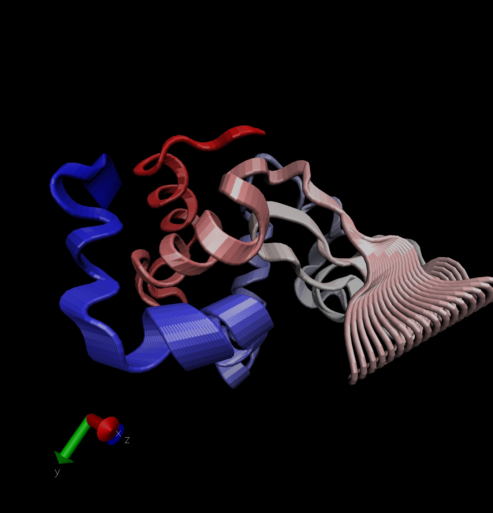
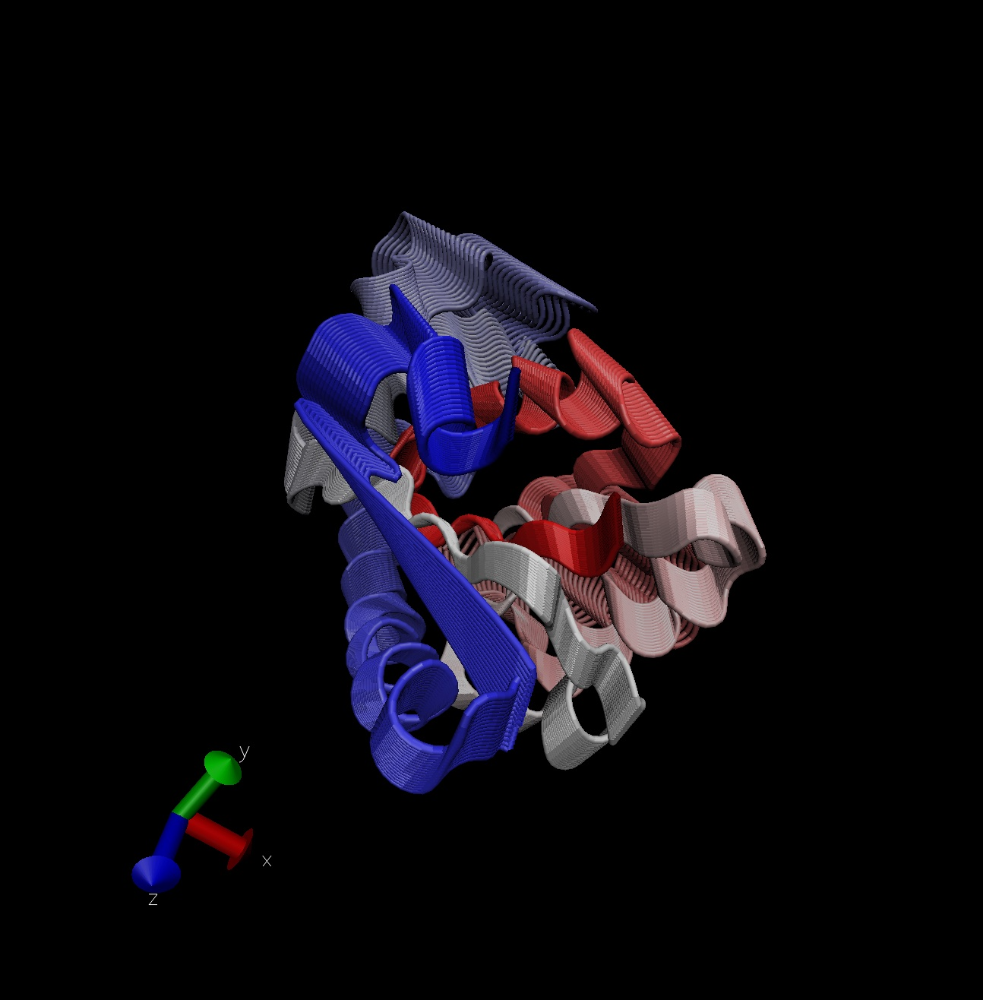

# Intro to Bio3D in R

Loading library
```{r}
library(bio3d)
pdb <- read.pdb("1hsg")
pdb
aa123(pdbseq(pdb))
```

> Q7: How many amino acid residues are there in this pdb object? 

198

> Q8: Name one of the two non-protein residues? 

MK1

> Q9: How many protein chains are in this structure?

2 Protein chains

# 4. Comparative structure analysis of Adenylate Kinase

Install packages in the R console not your Rmd

```{r}
#install.packages("bio3d")
#install.packages("ggplot2")
#install.packages("ggrepel")
#install.packages("devtools")
#install.packages("BiocManager")

#BiocManager::install("msa")
#devtools::install_bitbucket("Grantlab/bio3d-view")
```

> Q10. Which of the packages above is found only on BioConductor and not CRAN? 

"msa" package is found only on BioConductor and not CRAN. 

> Q11. Which of the above packages is not found on BioConductor or CRAN?: 

Package not found on BioConductor or CRAN is "Grantlab/bio3d-view". This is a package found from Github or BitBucket. 

> Q12. True or False? Functions from the devtools package can be used to install packages from GitHub and BitBucket? 
 
TRUE

```{r}
library(bio3d)
aa <- get.seq("1ake_A")
aa

```

> Q13. How many amino acids are in this sequence, i.e. how long is this sequence? 

214 amino acids.

```{r}
plot.bio3d(pdb$atom$b, sse=pdb)
```

```{r}
head(pdb$atom)
```

# Comparative analysis of protein structures

Using the bio3d package.

```{r}
library(bio3d)

pdb <- read.pdb("1hel")
pdb
```

Let's use a bioinformatics method called NMA (Normal Mode Analysis) to predict the dynamics (flexibility) of this enzyme. 

```{r}
modes <- nma(pdb)
plot(modes)
```

Make a "movie" of its predicted motion. We often call this a "trajectory".

```{r}
mktrj(modes, file = "nma.pdb")
```



# Analysis of ADK

```{r}
aa <- get.seq("1ake_A")
aa
```

```{r}
hits <- NULL
hits$pdb.id <- c('1AKE_A','4X8M_A','6S36_A','6RZE_A','4X8H_A','3HPR_A','1E4V_A','5EJE_A','1E4Y_A','3X2S_A','6HAP_A','6HAM_A','4K46_A','4NP6_A','3GMT_A','4PZL_A')
```

```{r}
hits$pdb.id
```

```{r}
# Download releated PDB files
files <- get.pdb(hits$pdb.id, path="pdbs", split=TRUE, gzip=TRUE)
```
Multiple structure alignment

```{r}
# Align releated PDBs
pdbs <- pdbaln(files, fit = TRUE)#, exefile="msa")
```

```{r}
pdbs
```

# PCA

We will use the bio3d pca() function which is designed for protein structure data.

```{r}
# Perform PCA
pc.xray <- pca(pdbs)
plot(pc.xray)
```
```{r}
# Calculate RMSD
rd <- rmsd(pdbs)

# Structure-based clustering
hc.rd <- hclust(dist(rd))
grps.rd <- cutree(hc.rd, k=3)

plot(pc.xray, 1:2, col="grey50", bg=grps.rd, pch=21, cex=1)

```

# Visualize first principal component
Make a trajectory visualization of the motion captured by the first Principal Component

```{r}
pc1 <- mktrj(pc.xray, pc=1, file="pc_1.pdb")

```


# Normal mode Analysis

NMA of all structures

```{r}
modes <- nma(pdbs)
plot(modes, pdbs, col=grps.rd)
```

> Q14. What do you note about this plot? Are the black and colored lines similar or different? Where do you think they differ most and why?

The black and colored lines look different at residue 50 and around 150. I think this differs where the conformational states for Adk are most different. 

