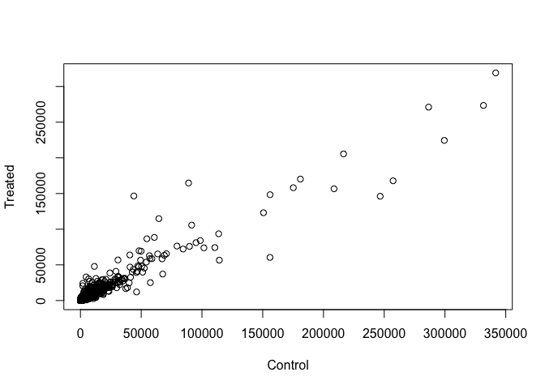
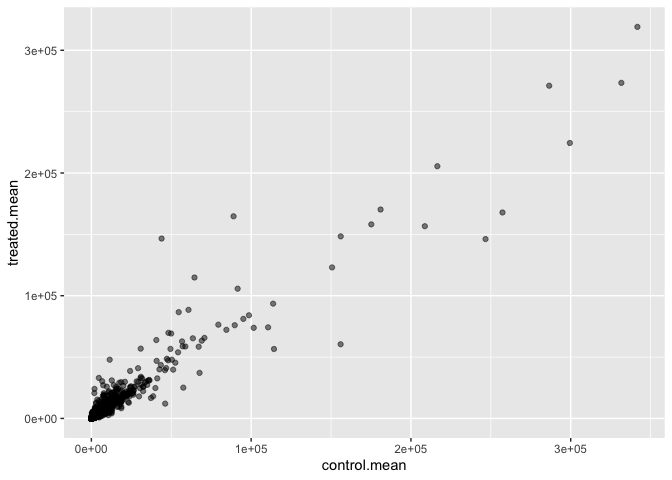
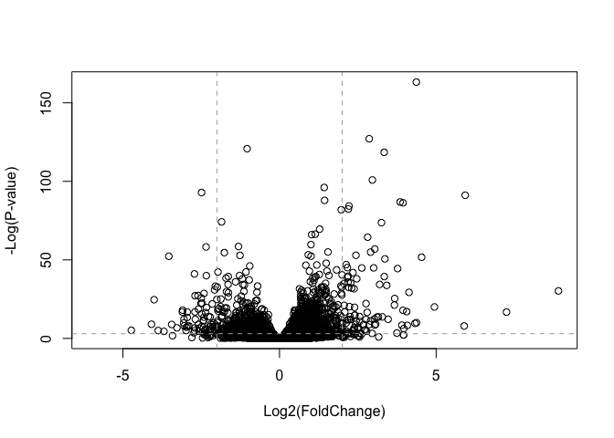
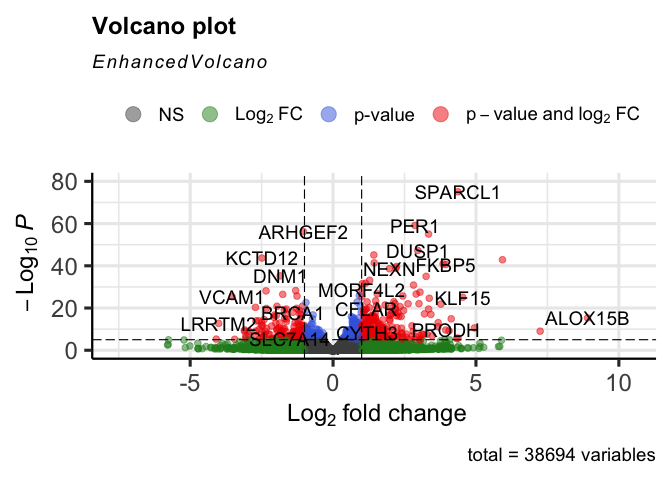
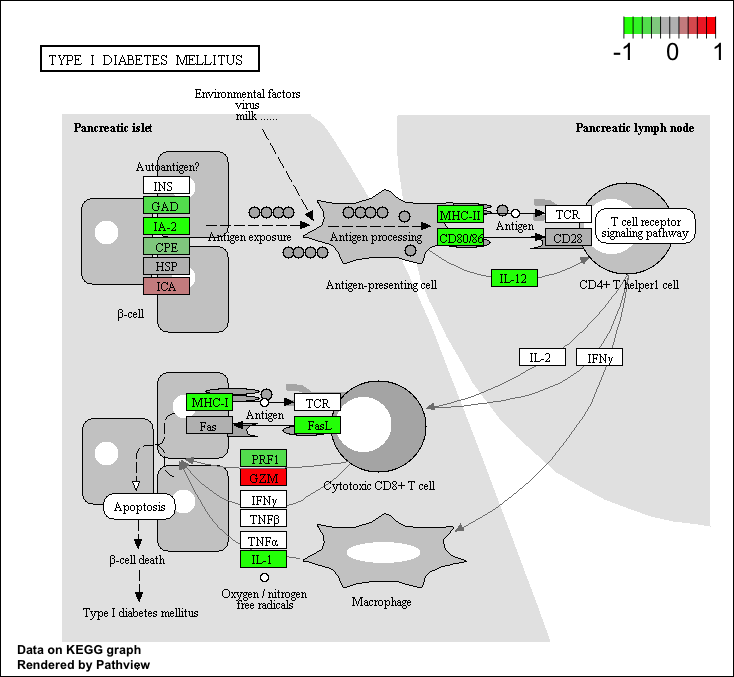
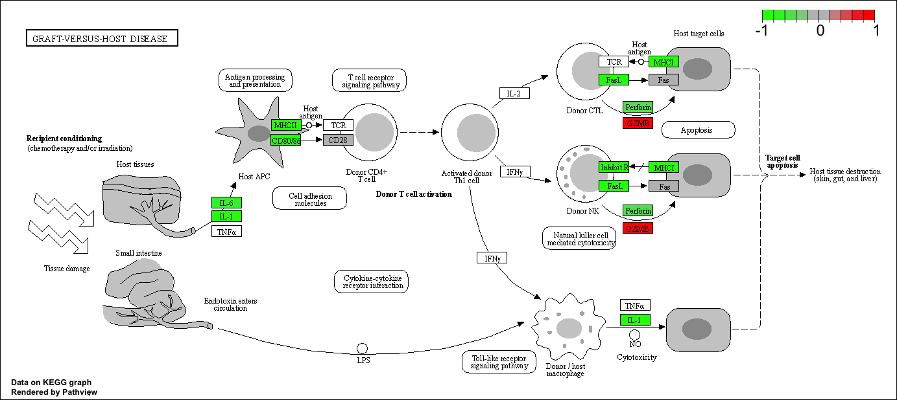

Class 15: Transcriptomics and the analysis of RNA-Seq data
================
Katherine Wong (A16162648)
11/16/2021

# Background

Our data for today comes from Himes et al. RNASeq analysis of the drug
dexamethasone, a synthetic glucocorticoid steroid with anti-inflammatory
effects (Himes et al. 2014).

Read the countData and colData.

``` r
counts <- read.csv("airway_scaledcounts.csv", row.names=1)
metadata <-  read.csv("airway_metadata.csv")
```

``` r
head(counts)
```

    ##                 SRR1039508 SRR1039509 SRR1039512 SRR1039513 SRR1039516
    ## ENSG00000000003        723        486        904        445       1170
    ## ENSG00000000005          0          0          0          0          0
    ## ENSG00000000419        467        523        616        371        582
    ## ENSG00000000457        347        258        364        237        318
    ## ENSG00000000460         96         81         73         66        118
    ## ENSG00000000938          0          0          1          0          2
    ##                 SRR1039517 SRR1039520 SRR1039521
    ## ENSG00000000003       1097        806        604
    ## ENSG00000000005          0          0          0
    ## ENSG00000000419        781        417        509
    ## ENSG00000000457        447        330        324
    ## ENSG00000000460         94        102         74
    ## ENSG00000000938          0          0          0

``` r
head(metadata)
```

    ##           id     dex celltype     geo_id
    ## 1 SRR1039508 control   N61311 GSM1275862
    ## 2 SRR1039509 treated   N61311 GSM1275863
    ## 3 SRR1039512 control  N052611 GSM1275866
    ## 4 SRR1039513 treated  N052611 GSM1275867
    ## 5 SRR1039516 control  N080611 GSM1275870
    ## 6 SRR1039517 treated  N080611 GSM1275871

> Q1. How many genes are in this dataset?

``` r
nrow(counts)
```

    ## [1] 38694

38694 genes in this dataset. &gt; Q2. How many ‘control’ cell lines do
we have?

``` r
sum(metadata$dex == "control")
```

    ## [1] 4

4 control cell lines

``` r
control <- metadata[metadata[,"dex"]=="control",]
control.counts <- counts[ ,control$id]
control.mean <- rowSums( control.counts )/4 
head(control.mean)
```

    ## ENSG00000000003 ENSG00000000005 ENSG00000000419 ENSG00000000457 ENSG00000000460 
    ##          900.75            0.00          520.50          339.75           97.25 
    ## ENSG00000000938 
    ##            0.75

> Q3. How would you make the above code in either approach more robust?

For both approaches, instead of dividing the mean by 4 I would divide by
sum(metadata$dex == “control”). This way if we have a different dataset
with more controls this code can be tailored for dfferent datasets.

> Q4. Follow the same procedure for the treated samples (i.e. calculate
> the mean per gene across drug treated samples and assign to a labeled
> vector called treated.mean)

``` r
treated <- metadata[metadata[,"dex"]=="treated",]
treated.mean <- rowSums( counts[ ,treated$id] )/4 
names(treated.mean) <- counts$ensgene
```

``` r
meancounts <- data.frame(control.mean, treated.mean)
colSums(meancounts)
```

    ## control.mean treated.mean 
    ##     23005324     22196524

> Q5 (a). Create a scatter plot showing the mean of the treated samples
> against the mean of the control samples.

``` r
plot(meancounts[,1],meancounts[,2], xlab="Control", ylab="Treated")
```

<!-- -->

> Q5 (b).You could also use the ggplot2 package to make this figure
> producing the plot below. What geom\_?() function would you use for
> this plot?

geom\_point() function with alpha = 0.5 argument.

``` r
library(ggplot2)
ggplot(meancounts) + aes(x = control.mean,y = treated.mean) + geom_point(alpha = 0.5)
```

<!-- -->

> Q6. Try plotting both axes on a log scale. What is the argument to
> plot() that allows you to do this?

log = “xy” to plot both axes on a log scale.

``` r
plot(meancounts[,1],meancounts[,2], log = "xy", xlab="log Control", ylab="log Treated")
```

    ## Warning in xy.coords(x, y, xlabel, ylabel, log): 15032 x values <= 0 omitted
    ## from logarithmic plot

    ## Warning in xy.coords(x, y, xlabel, ylabel, log): 15281 y values <= 0 omitted
    ## from logarithmic plot

<!-- -->

``` r
meancounts$log2fc <- log2(meancounts[,"treated.mean"]/meancounts[,"control.mean"])
head(meancounts)
```

    ##                 control.mean treated.mean      log2fc
    ## ENSG00000000003       900.75       658.00 -0.45303916
    ## ENSG00000000005         0.00         0.00         NaN
    ## ENSG00000000419       520.50       546.00  0.06900279
    ## ENSG00000000457       339.75       316.50 -0.10226805
    ## ENSG00000000460        97.25        78.75 -0.30441833
    ## ENSG00000000938         0.75         0.00        -Inf

We need to exclude the genes (i.e. rows) with zero counts because we
can’t say anything about these as we have no data for them!

``` r
# store which column indices are TRUE (0 values) in zero-vals
zero.vals <- which(meancounts[,1:2]==0, arr.ind=TRUE)

to.rm <- unique(zero.vals[,1])
mycounts <- meancounts[-to.rm,]
head(mycounts)
```

    ##                 control.mean treated.mean      log2fc
    ## ENSG00000000003       900.75       658.00 -0.45303916
    ## ENSG00000000419       520.50       546.00  0.06900279
    ## ENSG00000000457       339.75       316.50 -0.10226805
    ## ENSG00000000460        97.25        78.75 -0.30441833
    ## ENSG00000000971      5219.00      6687.50  0.35769358
    ## ENSG00000001036      2327.00      1785.75 -0.38194109

> Q7. What is the purpose of the arr.ind argument in the which()
> function call above? Why would we then take the first column of the
> output and need to call the unique() function?

To return both the row and column indices (i.e. positions) where there
are TRUE values. Tells us which genes and samples have 0 count. Calling
unique() will ensure we don’t count any row twice if it has zero entries
in both samples.

``` r
up.ind <- mycounts$log2fc > 2
down.ind <- mycounts$log2fc < (-2)
```

> Q8. Using the up.ind vector above can you determine how many up
> regulated genes we have at the greater than 2 fc level?

``` r
sum(up.ind == TRUE)
```

    ## [1] 250

250 upregulated genes.

> Q9. Using the down.ind vector above can you determine how many down
> regulated genes we have at the greater than 2 fc level?

``` r
sum(down.ind == TRUE)
```

    ## [1] 367

367 down-regulated genes.

> Q10. Do you trust these results? Why or why not?

No.This is because we haven’t looked for statistical significance yet.
Fold change can be large without being statistically significant.

\#DESeq2 Analysis

``` r
library(DESeq2)
```

    ## Loading required package: S4Vectors

    ## Loading required package: stats4

    ## Loading required package: BiocGenerics

    ## 
    ## Attaching package: 'BiocGenerics'

    ## The following objects are masked from 'package:stats':
    ## 
    ##     IQR, mad, sd, var, xtabs

    ## The following objects are masked from 'package:base':
    ## 
    ##     anyDuplicated, append, as.data.frame, basename, cbind, colnames,
    ##     dirname, do.call, duplicated, eval, evalq, Filter, Find, get, grep,
    ##     grepl, intersect, is.unsorted, lapply, Map, mapply, match, mget,
    ##     order, paste, pmax, pmax.int, pmin, pmin.int, Position, rank,
    ##     rbind, Reduce, rownames, sapply, setdiff, sort, table, tapply,
    ##     union, unique, unsplit, which.max, which.min

    ## 
    ## Attaching package: 'S4Vectors'

    ## The following objects are masked from 'package:base':
    ## 
    ##     expand.grid, I, unname

    ## Loading required package: IRanges

    ## Loading required package: GenomicRanges

    ## Loading required package: GenomeInfoDb

    ## Loading required package: SummarizedExperiment

    ## Loading required package: MatrixGenerics

    ## Loading required package: matrixStats

    ## 
    ## Attaching package: 'MatrixGenerics'

    ## The following objects are masked from 'package:matrixStats':
    ## 
    ##     colAlls, colAnyNAs, colAnys, colAvgsPerRowSet, colCollapse,
    ##     colCounts, colCummaxs, colCummins, colCumprods, colCumsums,
    ##     colDiffs, colIQRDiffs, colIQRs, colLogSumExps, colMadDiffs,
    ##     colMads, colMaxs, colMeans2, colMedians, colMins, colOrderStats,
    ##     colProds, colQuantiles, colRanges, colRanks, colSdDiffs, colSds,
    ##     colSums2, colTabulates, colVarDiffs, colVars, colWeightedMads,
    ##     colWeightedMeans, colWeightedMedians, colWeightedSds,
    ##     colWeightedVars, rowAlls, rowAnyNAs, rowAnys, rowAvgsPerColSet,
    ##     rowCollapse, rowCounts, rowCummaxs, rowCummins, rowCumprods,
    ##     rowCumsums, rowDiffs, rowIQRDiffs, rowIQRs, rowLogSumExps,
    ##     rowMadDiffs, rowMads, rowMaxs, rowMeans2, rowMedians, rowMins,
    ##     rowOrderStats, rowProds, rowQuantiles, rowRanges, rowRanks,
    ##     rowSdDiffs, rowSds, rowSums2, rowTabulates, rowVarDiffs, rowVars,
    ##     rowWeightedMads, rowWeightedMeans, rowWeightedMedians,
    ##     rowWeightedSds, rowWeightedVars

    ## Loading required package: Biobase

    ## Welcome to Bioconductor
    ## 
    ##     Vignettes contain introductory material; view with
    ##     'browseVignettes()'. To cite Bioconductor, see
    ##     'citation("Biobase")', and for packages 'citation("pkgname")'.

    ## 
    ## Attaching package: 'Biobase'

    ## The following object is masked from 'package:MatrixGenerics':
    ## 
    ##     rowMedians

    ## The following objects are masked from 'package:matrixStats':
    ## 
    ##     anyMissing, rowMedians

``` r
dds <- DESeqDataSetFromMatrix(countData=counts, 
                              colData=metadata, 
                              design=~dex)
```

    ## converting counts to integer mode

    ## Warning in DESeqDataSet(se, design = design, ignoreRank): some variables in
    ## design formula are characters, converting to factors

``` r
dds
```

    ## class: DESeqDataSet 
    ## dim: 38694 8 
    ## metadata(1): version
    ## assays(1): counts
    ## rownames(38694): ENSG00000000003 ENSG00000000005 ... ENSG00000283120
    ##   ENSG00000283123
    ## rowData names(0):
    ## colnames(8): SRR1039508 SRR1039509 ... SRR1039520 SRR1039521
    ## colData names(4): id dex celltype geo_id

``` r
dds <- DESeq(dds)
```

    ## estimating size factors

    ## estimating dispersions

    ## gene-wise dispersion estimates

    ## mean-dispersion relationship

    ## final dispersion estimates

    ## fitting model and testing

``` r
res <- results(dds)
res
```

    ## log2 fold change (MLE): dex treated vs control 
    ## Wald test p-value: dex treated vs control 
    ## DataFrame with 38694 rows and 6 columns
    ##                  baseMean log2FoldChange     lfcSE      stat    pvalue
    ##                 <numeric>      <numeric> <numeric> <numeric> <numeric>
    ## ENSG00000000003  747.1942     -0.3507030  0.168246 -2.084470 0.0371175
    ## ENSG00000000005    0.0000             NA        NA        NA        NA
    ## ENSG00000000419  520.1342      0.2061078  0.101059  2.039475 0.0414026
    ## ENSG00000000457  322.6648      0.0245269  0.145145  0.168982 0.8658106
    ## ENSG00000000460   87.6826     -0.1471420  0.257007 -0.572521 0.5669691
    ## ...                   ...            ...       ...       ...       ...
    ## ENSG00000283115  0.000000             NA        NA        NA        NA
    ## ENSG00000283116  0.000000             NA        NA        NA        NA
    ## ENSG00000283119  0.000000             NA        NA        NA        NA
    ## ENSG00000283120  0.974916      -0.668258   1.69456 -0.394354  0.693319
    ## ENSG00000283123  0.000000             NA        NA        NA        NA
    ##                      padj
    ##                 <numeric>
    ## ENSG00000000003  0.163035
    ## ENSG00000000005        NA
    ## ENSG00000000419  0.176032
    ## ENSG00000000457  0.961694
    ## ENSG00000000460  0.815849
    ## ...                   ...
    ## ENSG00000283115        NA
    ## ENSG00000283116        NA
    ## ENSG00000283119        NA
    ## ENSG00000283120        NA
    ## ENSG00000283123        NA

``` r
View(as.data.frame(res))
```

``` r
summary(res)
```

    ## 
    ## out of 25258 with nonzero total read count
    ## adjusted p-value < 0.1
    ## LFC > 0 (up)       : 1563, 6.2%
    ## LFC < 0 (down)     : 1188, 4.7%
    ## outliers [1]       : 142, 0.56%
    ## low counts [2]     : 9971, 39%
    ## (mean count < 10)
    ## [1] see 'cooksCutoff' argument of ?results
    ## [2] see 'independentFiltering' argument of ?results

``` r
res05 <- results(dds, alpha=0.05)
summary(res05)
```

    ## 
    ## out of 25258 with nonzero total read count
    ## adjusted p-value < 0.05
    ## LFC > 0 (up)       : 1236, 4.9%
    ## LFC < 0 (down)     : 933, 3.7%
    ## outliers [1]       : 142, 0.56%
    ## low counts [2]     : 9033, 36%
    ## (mean count < 6)
    ## [1] see 'cooksCutoff' argument of ?results
    ## [2] see 'independentFiltering' argument of ?results

\#Adding Annotation Data

``` r
library("AnnotationDbi")
```

    ## Warning: package 'AnnotationDbi' was built under R version 4.1.2

``` r
library("org.Hs.eg.db")
```

    ## 

``` r
columns(org.Hs.eg.db)
```

    ##  [1] "ACCNUM"       "ALIAS"        "ENSEMBL"      "ENSEMBLPROT"  "ENSEMBLTRANS"
    ##  [6] "ENTREZID"     "ENZYME"       "EVIDENCE"     "EVIDENCEALL"  "GENENAME"    
    ## [11] "GENETYPE"     "GO"           "GOALL"        "IPI"          "MAP"         
    ## [16] "OMIM"         "ONTOLOGY"     "ONTOLOGYALL"  "PATH"         "PFAM"        
    ## [21] "PMID"         "PROSITE"      "REFSEQ"       "SYMBOL"       "UCSCKG"      
    ## [26] "UNIPROT"

``` r
res$symbol <- mapIds(org.Hs.eg.db,
                     keys=row.names(res), # Our genenames
                     keytype="ENSEMBL",        # The format of our genenames
                     column="SYMBOL",          # The new format we want to add
                     multiVals="first")
```

    ## 'select()' returned 1:many mapping between keys and columns

``` r
head(res)
```

    ## log2 fold change (MLE): dex treated vs control 
    ## Wald test p-value: dex treated vs control 
    ## DataFrame with 6 rows and 7 columns
    ##                   baseMean log2FoldChange     lfcSE      stat    pvalue
    ##                  <numeric>      <numeric> <numeric> <numeric> <numeric>
    ## ENSG00000000003 747.194195     -0.3507030  0.168246 -2.084470 0.0371175
    ## ENSG00000000005   0.000000             NA        NA        NA        NA
    ## ENSG00000000419 520.134160      0.2061078  0.101059  2.039475 0.0414026
    ## ENSG00000000457 322.664844      0.0245269  0.145145  0.168982 0.8658106
    ## ENSG00000000460  87.682625     -0.1471420  0.257007 -0.572521 0.5669691
    ## ENSG00000000938   0.319167     -1.7322890  3.493601 -0.495846 0.6200029
    ##                      padj      symbol
    ##                 <numeric> <character>
    ## ENSG00000000003  0.163035      TSPAN6
    ## ENSG00000000005        NA        TNMD
    ## ENSG00000000419  0.176032        DPM1
    ## ENSG00000000457  0.961694       SCYL3
    ## ENSG00000000460  0.815849    C1orf112
    ## ENSG00000000938        NA         FGR

> Q11. Run the mapIds() function two more times to add the Entrez ID and
> UniProt accession and GENENAME as new columns called
> res*e**n**t**r**e**z*, *r**e**s*uniprot and res$genename.

``` r
res$entrez <- mapIds(org.Hs.eg.db,
                     keys=row.names(res),
                     column="ENTREZID",
                     keytype="ENSEMBL",
                     multiVals="first")
```

    ## 'select()' returned 1:many mapping between keys and columns

``` r
res$uniprot <- mapIds(org.Hs.eg.db,
                     keys=row.names(res),
                     column="UNIPROT",
                     keytype="ENSEMBL",
                     multiVals="first")
```

    ## 'select()' returned 1:many mapping between keys and columns

``` r
res$genename <- mapIds(org.Hs.eg.db,
                     keys=row.names(res),
                     column="GENENAME",
                     keytype="ENSEMBL",
                     multiVals="first")
```

    ## 'select()' returned 1:many mapping between keys and columns

``` r
head(res)
```

    ## log2 fold change (MLE): dex treated vs control 
    ## Wald test p-value: dex treated vs control 
    ## DataFrame with 6 rows and 10 columns
    ##                   baseMean log2FoldChange     lfcSE      stat    pvalue
    ##                  <numeric>      <numeric> <numeric> <numeric> <numeric>
    ## ENSG00000000003 747.194195     -0.3507030  0.168246 -2.084470 0.0371175
    ## ENSG00000000005   0.000000             NA        NA        NA        NA
    ## ENSG00000000419 520.134160      0.2061078  0.101059  2.039475 0.0414026
    ## ENSG00000000457 322.664844      0.0245269  0.145145  0.168982 0.8658106
    ## ENSG00000000460  87.682625     -0.1471420  0.257007 -0.572521 0.5669691
    ## ENSG00000000938   0.319167     -1.7322890  3.493601 -0.495846 0.6200029
    ##                      padj      symbol      entrez     uniprot
    ##                 <numeric> <character> <character> <character>
    ## ENSG00000000003  0.163035      TSPAN6        7105  A0A024RCI0
    ## ENSG00000000005        NA        TNMD       64102      Q9H2S6
    ## ENSG00000000419  0.176032        DPM1        8813      O60762
    ## ENSG00000000457  0.961694       SCYL3       57147      Q8IZE3
    ## ENSG00000000460  0.815849    C1orf112       55732  A0A024R922
    ## ENSG00000000938        NA         FGR        2268      P09769
    ##                               genename
    ##                            <character>
    ## ENSG00000000003          tetraspanin 6
    ## ENSG00000000005            tenomodulin
    ## ENSG00000000419 dolichyl-phosphate m..
    ## ENSG00000000457 SCY1 like pseudokina..
    ## ENSG00000000460 chromosome 1 open re..
    ## ENSG00000000938 FGR proto-oncogene, ..

``` r
ord <- order( res$padj )
#View(res[ord,])
head(res[ord,])
```

    ## log2 fold change (MLE): dex treated vs control 
    ## Wald test p-value: dex treated vs control 
    ## DataFrame with 6 rows and 10 columns
    ##                  baseMean log2FoldChange     lfcSE      stat      pvalue
    ##                 <numeric>      <numeric> <numeric> <numeric>   <numeric>
    ## ENSG00000152583   954.771        4.36836 0.2371268   18.4220 8.74490e-76
    ## ENSG00000179094   743.253        2.86389 0.1755693   16.3120 8.10784e-60
    ## ENSG00000116584  2277.913       -1.03470 0.0650984  -15.8944 6.92855e-57
    ## ENSG00000189221  2383.754        3.34154 0.2124058   15.7319 9.14433e-56
    ## ENSG00000120129  3440.704        2.96521 0.2036951   14.5571 5.26424e-48
    ## ENSG00000148175 13493.920        1.42717 0.1003890   14.2164 7.25128e-46
    ##                        padj      symbol      entrez     uniprot
    ##                   <numeric> <character> <character> <character>
    ## ENSG00000152583 1.32441e-71     SPARCL1        8404  A0A024RDE1
    ## ENSG00000179094 6.13966e-56        PER1        5187      O15534
    ## ENSG00000116584 3.49776e-53     ARHGEF2        9181      Q92974
    ## ENSG00000189221 3.46227e-52        MAOA        4128      P21397
    ## ENSG00000120129 1.59454e-44       DUSP1        1843      B4DU40
    ## ENSG00000148175 1.83034e-42        STOM        2040      F8VSL7
    ##                               genename
    ##                            <character>
    ## ENSG00000152583           SPARC like 1
    ## ENSG00000179094 period circadian reg..
    ## ENSG00000116584 Rho/Rac guanine nucl..
    ## ENSG00000189221    monoamine oxidase A
    ## ENSG00000120129 dual specificity pho..
    ## ENSG00000148175               stomatin

``` r
write.csv(res[ord,], "deseq_results.csv")
```

\#Volcano Plots

``` r
plot( res$log2FoldChange,  -log(res$padj), 
      xlab="Log2(FoldChange)",
      ylab="-Log(P-value)")
# Add some cut-off lines
# Vertical lines 
abline(v=c(-2,2), col="darkgray", lty=2)
# Horizontal lines
abline(h=-log(0.05), col="darkgray", lty=2)
```

<!-- -->

``` r
# Setup our custom point color vector 
mycols <- rep("gray", nrow(res))
mycols[ abs(res$log2FoldChange) > 2 ]  <- "red" 

inds <- (res$padj < 0.01) & (abs(res$log2FoldChange) > 2 )
mycols[ inds ] <- "blue"

# Volcano plot with custom colors 
plot( res$log2FoldChange,  -log(res$padj), 
 col=mycols, ylab="-Log(P-value)", xlab="Log2(FoldChange)" )

# Cut-off lines
abline(v=c(-2,2), col="gray", lty=2)
abline(h=-log(0.1), col="gray", lty=2)
```

<!-- -->

``` r
library(EnhancedVolcano)
```

    ## Loading required package: ggrepel

    ## Registered S3 methods overwritten by 'ggalt':
    ##   method                  from   
    ##   grid.draw.absoluteGrob  ggplot2
    ##   grobHeight.absoluteGrob ggplot2
    ##   grobWidth.absoluteGrob  ggplot2
    ##   grobX.absoluteGrob      ggplot2
    ##   grobY.absoluteGrob      ggplot2

``` r
x <- as.data.frame(res)

EnhancedVolcano(x,
    lab = x$symbol,
    x = 'log2FoldChange',
    y = 'pvalue')
```

<!-- --> \#Pathway
Analysis

``` r
library(pathview)
```

    ## ##############################################################################
    ## Pathview is an open source software package distributed under GNU General
    ## Public License version 3 (GPLv3). Details of GPLv3 is available at
    ## http://www.gnu.org/licenses/gpl-3.0.html. Particullary, users are required to
    ## formally cite the original Pathview paper (not just mention it) in publications
    ## or products. For details, do citation("pathview") within R.
    ## 
    ## The pathview downloads and uses KEGG data. Non-academic uses may require a KEGG
    ## license agreement (details at http://www.kegg.jp/kegg/legal.html).
    ## ##############################################################################

``` r
library(gage)
```

    ## 

``` r
library(gageData)

data(kegg.sets.hs)

# Examine the first 2 pathways in this kegg set for humans
head(kegg.sets.hs, 2)
```

    ## $`hsa00232 Caffeine metabolism`
    ## [1] "10"   "1544" "1548" "1549" "1553" "7498" "9"   
    ## 
    ## $`hsa00983 Drug metabolism - other enzymes`
    ##  [1] "10"     "1066"   "10720"  "10941"  "151531" "1548"   "1549"   "1551"  
    ##  [9] "1553"   "1576"   "1577"   "1806"   "1807"   "1890"   "221223" "2990"  
    ## [17] "3251"   "3614"   "3615"   "3704"   "51733"  "54490"  "54575"  "54576" 
    ## [25] "54577"  "54578"  "54579"  "54600"  "54657"  "54658"  "54659"  "54963" 
    ## [33] "574537" "64816"  "7083"   "7084"   "7172"   "7363"   "7364"   "7365"  
    ## [41] "7366"   "7367"   "7371"   "7372"   "7378"   "7498"   "79799"  "83549" 
    ## [49] "8824"   "8833"   "9"      "978"

``` r
foldchanges = res$log2FoldChange
names(foldchanges) = res$entrez
head(foldchanges)
```

    ##        7105       64102        8813       57147       55732        2268 
    ## -0.35070302          NA  0.20610777  0.02452695 -0.14714205 -1.73228897

``` r
# Get the results
keggres = gage(foldchanges, gsets=kegg.sets.hs)
```

``` r
attributes(keggres)
```

    ## $names
    ## [1] "greater" "less"    "stats"

``` r
# Look at the first three down (less) pathways
head(keggres$less, 3)
```

    ##                                       p.geomean stat.mean        p.val
    ## hsa05332 Graft-versus-host disease 0.0004250461 -3.473346 0.0004250461
    ## hsa04940 Type I diabetes mellitus  0.0017820293 -3.002352 0.0017820293
    ## hsa05310 Asthma                    0.0020045888 -3.009050 0.0020045888
    ##                                         q.val set.size         exp1
    ## hsa05332 Graft-versus-host disease 0.09053483       40 0.0004250461
    ## hsa04940 Type I diabetes mellitus  0.14232581       42 0.0017820293
    ## hsa05310 Asthma                    0.14232581       29 0.0020045888

``` r
pathview(gene.data=foldchanges, pathway.id="hsa05310")
```

    ## 'select()' returned 1:1 mapping between keys and columns

    ## Info: Working in directory /Users/katherinemwong/Desktop/bimm143/bimm143_github/class15

    ## Info: Writing image file hsa05310.pathview.png

 &gt; Q12. Can you do the same procedure as
above to plot the pathview figures for the top 2 down-reguled pathways?

``` r
pathview(gene.data=foldchanges, pathway.id="hsa04940")
```

    ## 'select()' returned 1:1 mapping between keys and columns

    ## Info: Working in directory /Users/katherinemwong/Desktop/bimm143/bimm143_github/class15

    ## Info: Writing image file hsa04940.pathview.png

``` r
pathview(gene.data=foldchanges, pathway.id="hsa05332")
```

    ## 'select()' returned 1:1 mapping between keys and columns

    ## Info: Working in directory /Users/katherinemwong/Desktop/bimm143/bimm143_github/class15

    ## Info: Writing image file hsa05332.pathview.png

 
