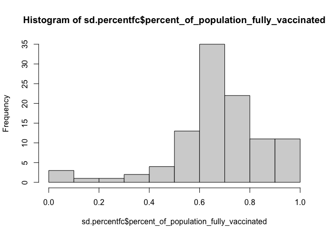
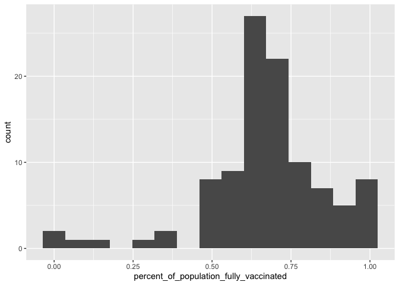
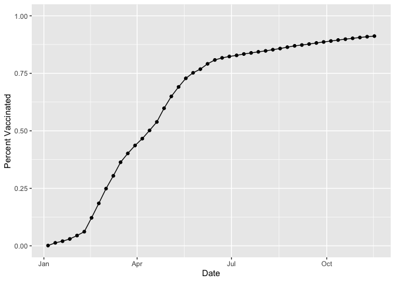
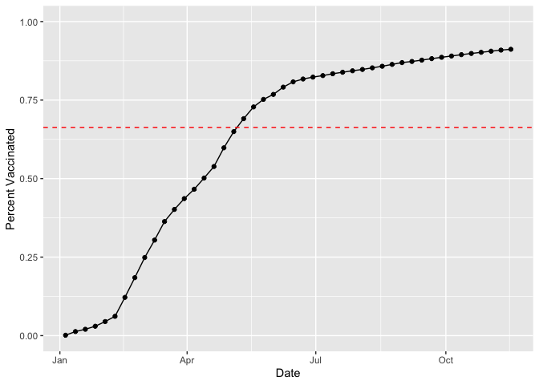
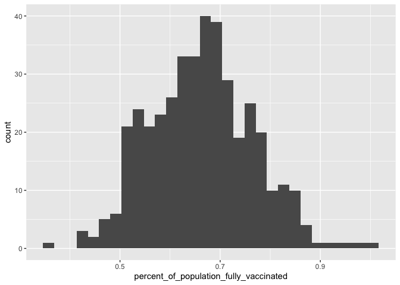
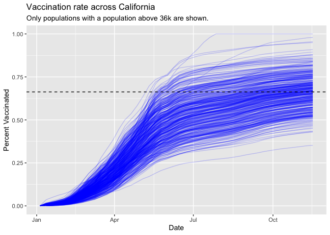

Class 17: Vaccination Rate Mini-Project
================
Katherine Wong (A16162648)
11/23/2021

``` r
# Import vaccination data
vax <- read.csv('covid19vaccinesbyzipcode_test.csv')
head(vax)
```

    ##   as_of_date zip_code_tabulation_area local_health_jurisdiction    county
    ## 1 2021-01-05                    92804                    Orange    Orange
    ## 2 2021-01-05                    92626                    Orange    Orange
    ## 3 2021-01-05                    92250                  Imperial  Imperial
    ## 4 2021-01-05                    92637                    Orange    Orange
    ## 5 2021-01-05                    92155                 San Diego San Diego
    ## 6 2021-01-05                    92259                  Imperial  Imperial
    ##   vaccine_equity_metric_quartile                 vem_source
    ## 1                              2 Healthy Places Index Score
    ## 2                              3 Healthy Places Index Score
    ## 3                              1 Healthy Places Index Score
    ## 4                              3 Healthy Places Index Score
    ## 5                             NA            No VEM Assigned
    ## 6                              1    CDPH-Derived ZCTA Score
    ##   age12_plus_population age5_plus_population persons_fully_vaccinated
    ## 1               76455.9                84200                       19
    ## 2               44238.8                47883                       NA
    ## 3                7098.5                 8026                       NA
    ## 4               16027.4                16053                       NA
    ## 5                 456.0                  456                       NA
    ## 6                 119.0                  121                       NA
    ##   persons_partially_vaccinated percent_of_population_fully_vaccinated
    ## 1                         1282                               0.000226
    ## 2                           NA                                     NA
    ## 3                           NA                                     NA
    ## 4                           NA                                     NA
    ## 5                           NA                                     NA
    ## 6                           NA                                     NA
    ##   percent_of_population_partially_vaccinated
    ## 1                                   0.015226
    ## 2                                         NA
    ## 3                                         NA
    ## 4                                         NA
    ## 5                                         NA
    ## 6                                         NA
    ##   percent_of_population_with_1_plus_dose
    ## 1                               0.015452
    ## 2                                     NA
    ## 3                                     NA
    ## 4                                     NA
    ## 5                                     NA
    ## 6                                     NA
    ##                                                                redacted
    ## 1                                                                    No
    ## 2 Information redacted in accordance with CA state privacy requirements
    ## 3 Information redacted in accordance with CA state privacy requirements
    ## 4 Information redacted in accordance with CA state privacy requirements
    ## 5 Information redacted in accordance with CA state privacy requirements
    ## 6 Information redacted in accordance with CA state privacy requirements

> Q1. What column details the total number of people fully vaccinated?

persons\_fully\_vaccinated

> Q2. What column details the Zip code tabulation area?

zip\_code\_tabulation\_area

> Q3. What is the earliest date in this dataset?

``` r
min(vax$as_of_date)
```

    ## [1] "2021-01-05"

2021-01-05

> Q4. What is the latest date in this dataset?

``` r
max(vax$as_of_date)
```

    ## [1] "2021-11-16"

2021-11-16

``` r
#skimr::skim(vax)
```

> Q5. How many numeric columns are in this dataset?

9

> Q6. Note that there are “missing values” in the dataset. How many NA
> values there in the persons\_fully\_vaccinated column?

8256

``` r
sum( is.na(vax$persons_fully_vaccinated) )
```

    ## [1] 8256

> Q7. What percent of persons\_fully\_vaccinated values are missing (to
> 2 significant figures)?

``` r
sum(is.na(vax$persons_fully_vaccinated))/length(vax$persons_fully_vaccinated)
```

    ## [1] 0.101745

0.10 or 10%

> Q8. \[Optional\]: Why might this data be missing?

The data might be missing because the data includes the dates of the
first dose and we wouldn’t know if they’re fully vaccinated yet if we
only administered the first dose. It could also be because the zip codes
are military bases.

# Working with dates

``` r
library(lubridate)
```

    ## 
    ## Attaching package: 'lubridate'

    ## The following objects are masked from 'package:base':
    ## 
    ##     date, intersect, setdiff, union

``` r
today()
```

    ## [1] "2021-12-04"

``` r
# Specify that we are using the Year-mont-day format
vax$as_of_date <- ymd(vax$as_of_date)
today() - vax$as_of_date[1]
```

    ## Time difference of 333 days

``` r
vax$as_of_date[nrow(vax)] - vax$as_of_date[1]
```

    ## Time difference of 315 days

> Q9. How many days between the first and last entry in the dataset?

``` r
vax$as_of_date[nrow(vax)] - vax$as_of_date[1]
```

    ## Time difference of 315 days

315 days.

> Q10. How many unique dates are in the dataset (i.e. how many different
> dates are detailed)?

``` r
length(unique(vax$as_of_date))
```

    ## [1] 46

46 unique dates in the dataset.

# Working with Zip Codes

``` r
library(zipcodeR)
geocode_zip('92037')
```

    ## # A tibble: 1 × 3
    ##   zipcode   lat   lng
    ##   <chr>   <dbl> <dbl>
    ## 1 92037    32.8 -117.

``` r
zip_distance('92037','92109')
```

    ##   zipcode_a zipcode_b distance
    ## 1     92037     92109     2.33

``` r
reverse_zipcode(c('92037', "92109") )
```

    ## # A tibble: 2 × 24
    ##   zipcode zipcode_type major_city post_office_city common_city_list county state
    ##   <chr>   <chr>        <chr>      <chr>                      <blob> <chr>  <chr>
    ## 1 92037   Standard     La Jolla   La Jolla, CA           <raw 20 B> San D… CA   
    ## 2 92109   Standard     San Diego  San Diego, CA          <raw 21 B> San D… CA   
    ## # … with 17 more variables: lat <dbl>, lng <dbl>, timezone <chr>,
    ## #   radius_in_miles <dbl>, area_code_list <blob>, population <int>,
    ## #   population_density <dbl>, land_area_in_sqmi <dbl>,
    ## #   water_area_in_sqmi <dbl>, housing_units <int>,
    ## #   occupied_housing_units <int>, median_home_value <int>,
    ## #   median_household_income <int>, bounds_west <dbl>, bounds_east <dbl>,
    ## #   bounds_north <dbl>, bounds_south <dbl>

``` r
# Pull data for all ZIP codes in the dataset
#zipdata <- reverse_zipcode( vax$zip_code_tabulation_area )
```

# Focus on the San Diego Area

``` r
# Subset to San Diego county only areas
sd <- vax[vax$county == "San Diego", ]
```

``` r
library(dplyr)
```

    ## 
    ## Attaching package: 'dplyr'

    ## The following objects are masked from 'package:stats':
    ## 
    ##     filter, lag

    ## The following objects are masked from 'package:base':
    ## 
    ##     intersect, setdiff, setequal, union

``` r
sd <- filter(vax, county == "San Diego")

nrow(sd)
```

    ## [1] 4922

``` r
sd.10 <- filter(vax, county == "San Diego" &
                age5_plus_population > 10000)
```

> Q11. How many distinct zip codes are listed for San Diego County?

``` r
length(unique(sd$zip_code_tabulation_area))
```

    ## [1] 107

107 distinct zipcodes.

> Q12. What San Diego County Zip code area has the largest 12 +
> Population in this dataset?

``` r
sd$zip_code_tabulation_area[which.max(sd$age12_plus_population)]
```

    ## [1] 92154

Zipcode 92154 has the largest 12+ population.

> Q13. What is the overall average “Percent of Population Fully
> Vaccinated” value for all San Diego “County” as of “2021-11-09”?

``` r
sd.percentfc <- filter(vax, county == "San Diego" & as_of_date == "2021-11-09")

mean(sd.percentfc$percent_of_population_fully_vaccinated, na.rm = TRUE)
```

    ## [1] 0.6727567

average is 0.673

``` r
summary(sd.percentfc$percent_of_population_fully_vaccinated)
```

    ##    Min. 1st Qu.  Median    Mean 3rd Qu.    Max.    NA's 
    ## 0.01017 0.60776 0.67700 0.67276 0.76164 1.00000       4

> Q14. Using either ggplot or base R graphics make a summary figure that
> shows the distribution of Percent of Population Fully Vaccinated
> values as of “2021-11-09”?

``` r
library(ggplot2)
hist(sd.percentfc$percent_of_population_fully_vaccinated)
```

<!-- -->

``` r
ggplot(sd.percentfc) + aes(percent_of_population_fully_vaccinated) + geom_histogram(bins = 15)
```

    ## Warning: Removed 4 rows containing non-finite values (stat_bin).

<!-- -->

# Focus on UCSD / La Jolla

``` r
ucsd <- filter(sd, zip_code_tabulation_area=="92037")
ucsd[1,]$age5_plus_population
```

    ## [1] 36144

> Q15. Using ggplot make a graph of the vaccination rate time course for
> the 92037 ZIP code area:

``` r
ggplot(ucsd) +
  aes(as_of_date,
      percent_of_population_fully_vaccinated) +
  geom_point() +
  geom_line(group=1) +
  ylim(c(0,1)) +
  labs(x = "Date", y="Percent Vaccinated")
```

<!-- -->

# Comparing 92037 to other similar sized areas

``` r
# Subset to all CA areas with a population as large as 92037
vax.36 <- filter(vax, age5_plus_population > 36144 &
                as_of_date == "2021-11-16")

#head(vax.36)
```

> Q16. Calculate the mean “Percent of Population Fully Vaccinated” for
> ZIP code areas with a population as large as 92037 (La Jolla)
> as\_of\_date “2021-11-16”. Add this as a straight horizontal line to
> your plot from above with the geom\_hline() function?

``` r
mean.36 <- mean(vax.36$percent_of_population_fully_vaccinated)
mean.36
```

    ## [1] 0.6629812

> Q15. Using ggplot make a graph of the vaccination rate time course for
> the 92037 ZIP code area:

``` r
ggplot(ucsd) +
  aes(as_of_date,
      percent_of_population_fully_vaccinated) +
  geom_point() +
  geom_line(group=1) +
  ylim(c(0,1)) +
  labs(x = "Date", y="Percent Vaccinated") + 
  geom_hline(yintercept = mean.36, col = "red", linetype = "dashed")
```

<!-- --> &gt; Q17.
What is the 6 number summary (Min, 1st Qu., Median, Mean, 3rd Qu., and
Max) of the “Percent of Population Fully Vaccinated” values for ZIP code
areas with a population as large as 92037 (La Jolla) as\_of\_date
“2021-11-16”?

``` r
summary(vax.36$percent_of_population_fully_vaccinated)
```

    ##    Min. 1st Qu.  Median    Mean 3rd Qu.    Max. 
    ##  0.3519  0.5891  0.6649  0.6630  0.7286  1.0000

Min: 0.3519 1st Qu: 0.5891 Median: 0.6649 Mean: 0.6630 3rd Qu: 0.7286
Max = 1

> Q18. Using ggplot generate a histogram of this data.

``` r
ggplot(vax.36) + aes(percent_of_population_fully_vaccinated) + geom_histogram(bin = 15)
```

    ## Warning: Ignoring unknown parameters: bin

    ## `stat_bin()` using `bins = 30`. Pick better value with `binwidth`.

<!-- -->

> Q19. Is the 92109 and 92040 ZIP code areas above or below the average
> value you calculated for all these above?

The average I calculated above is 0.6629812 For 92109, it is below the
average value. For 92040, it is above the average.

``` r
vax %>% filter(as_of_date == "2021-11-16") %>%  
  filter(zip_code_tabulation_area=="92040") %>%
  select(percent_of_population_fully_vaccinated)
```

    ##   percent_of_population_fully_vaccinated
    ## 1                               0.520463

``` r
vax %>% filter(as_of_date == "2021-11-16") %>%  
  filter(zip_code_tabulation_area=="92109") %>%
  select(percent_of_population_fully_vaccinated)
```

    ##   percent_of_population_fully_vaccinated
    ## 1                               0.687763

> Q20. Finally make a time course plot of vaccination progress for all
> areas in the full dataset with a age5\_plus\_population &gt; 36144.

``` r
vax.36.all <- filter(vax, age5_plus_population > 36144)

ggplot(vax.36.all) +
  aes(as_of_date,
      percent_of_population_fully_vaccinated, 
      group=zip_code_tabulation_area) +
  geom_line(alpha=0.2, color="blue") +
  ylim(0, 1) +
  labs(x="Date", y="Percent Vaccinated",
       title="Vaccination rate across California",
       subtitle="Only populations with a population above 36k are shown.") +
  geom_hline(yintercept = mean.36, linetype= "dashed")
```

    ## Warning: Removed 180 row(s) containing missing values (geom_path).

<!-- -->

> Q21. How do you feel about traveling for Thanksgiving and meeting for
> in-person class next Week?

I’m a little scared because I personally wouldn’t want to be sick during
finals week.
